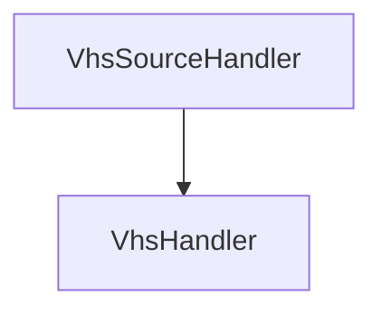
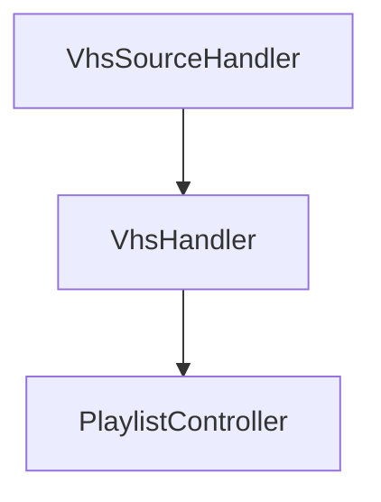
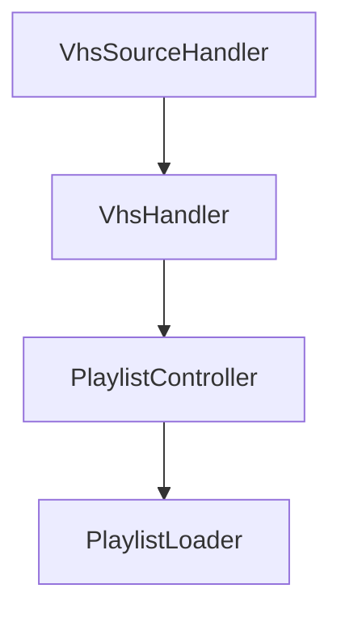
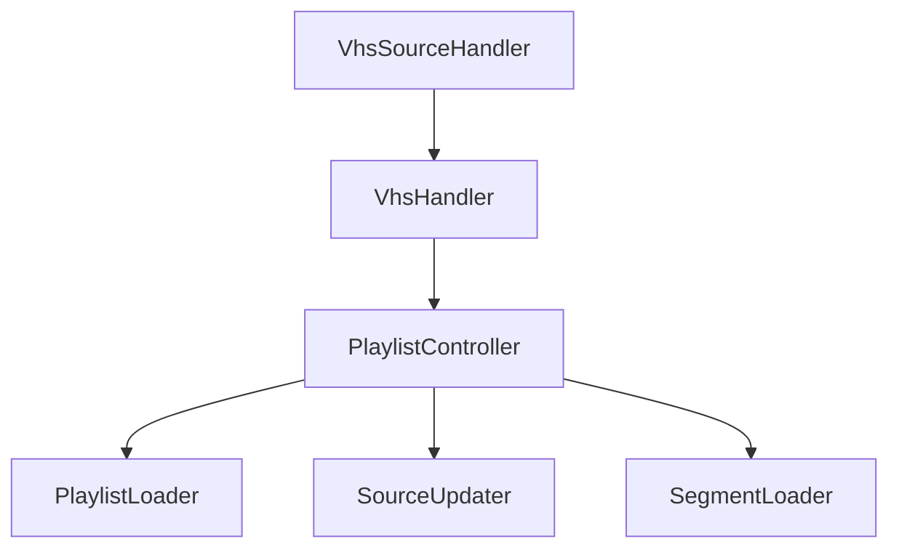
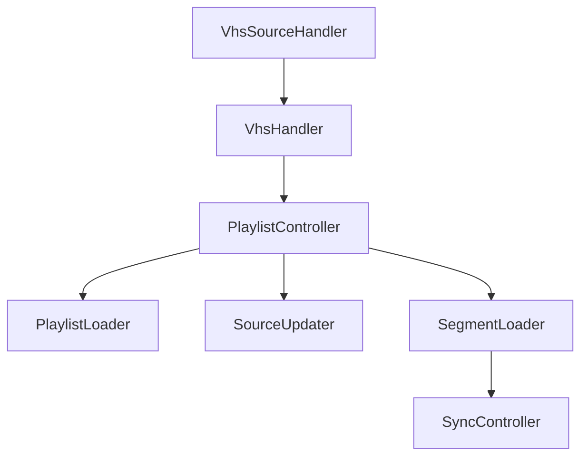
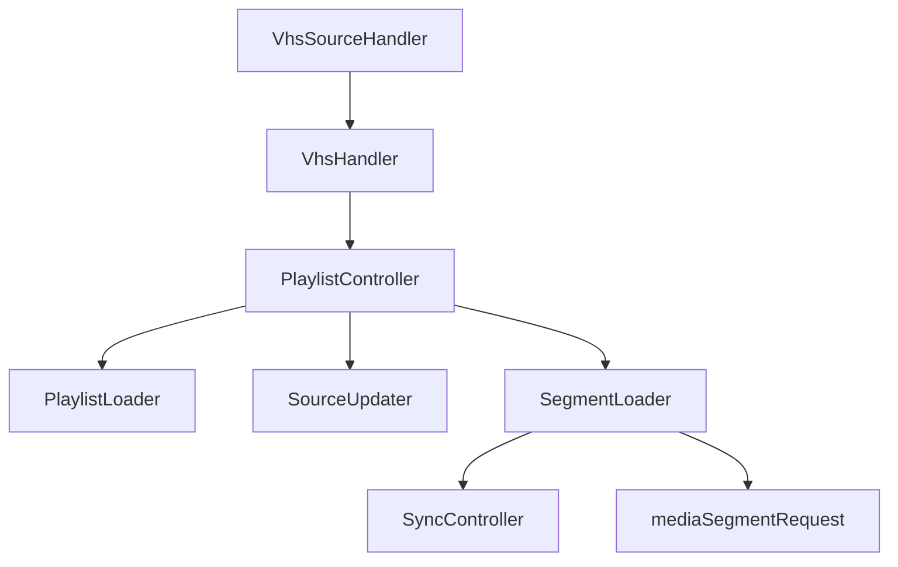
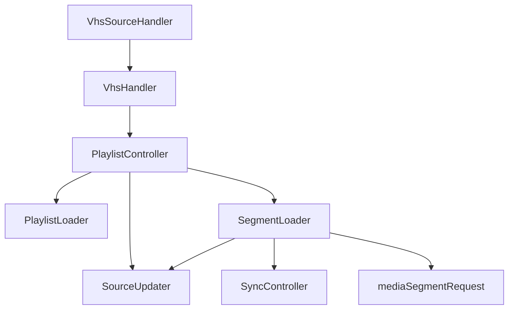
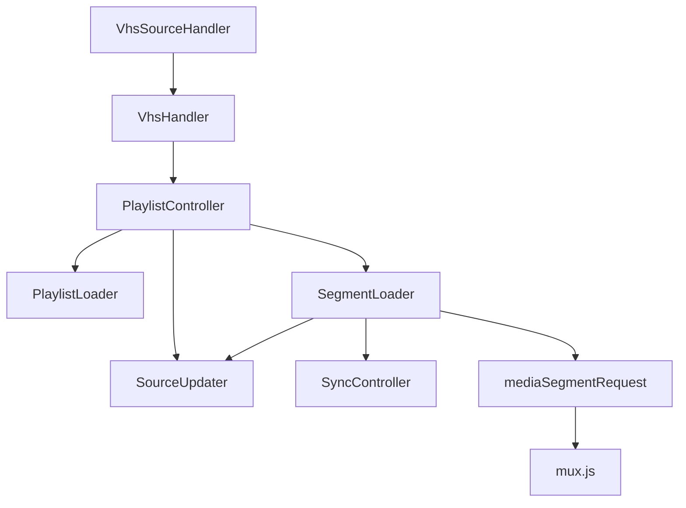

# A Walk Through VHS

Today we're going to take a walk through VHS. We'll start from a manifest URL and end with video playback.

The purpose of this walk is not to see every piece of code, or define every module. Instead it's about seeing the most important parts of VHS. The goal is to make VHS more approachable.

Lets start with a video tag:

```html
<video>
  <source src="http://example.com/manifest.m3u8" type="application/x-mpegURL">
</video>
```

The source, `manifest.m3u8`, is an HLS manifest. You can tell from the `.m3u8` extension and the `type`.

Safari (and a few other browsers) will play that video natively, because Safari supports HLS content. However, other browsers don't support native playback of HLS and will fail to play the video.

VHS provides the ability to play HLS (and DASH) content in browsers that don't support native HLS (and DASH) playback.

Since VHS is a part of Video.js, let's set up a Video.js player for the `<video>`:

```html
<link href="//vjs.zencdn.net/7.10.2/video-js.min.css" rel="stylesheet">
<script src="//vjs.zencdn.net/7.10.2/video.min.js"></script>

<video-js id="myPlayer" class="video-js" data-setup='{}'>
  <source src="http://example.com/manifest.m3u8" type="application/x-mpegURL">
</video-js>
```

Video.js does a lot of things, but in the context of VHS, the important feature is a way to let VHS handle playback of the source. To do this, VHS is registered as a Video.js Source Handler. When a Video.js player is created and provided a `<source>`, Video.js goes through its list of registered Source Handlers, including VHS, to see if they're able to play that source.

In this case, because it's an HLS source, VHS will tell Video.js "I can handle that!" From there, VHS is given the URL and it begins its process.

## videojs-http-streaming.js

`VhsSourceHandler` is defined at the [bottom of src/videojs-http-streaming.js](https://github.com/videojs/http-streaming/blob/0964cb4827d9e80aa36f2fa29e35dad92ca84111/src/videojs-http-streaming.js#L1226-L1233).

The function which Video.js calls to see if the `VhsSourceHandler` can handle the source is aptly named `canHandleSource`.

Inside `canHandleSource`, VHS checks the source's `type`. In our case, it sees `application/x-mpegURL`, and, if we're running in a browser with MSE, then it says "I can handle it!" (It actually says "maybe," because in life there are few guarantees, and because the spec says to use "maybe.")

### VhsSourceHandler

Since VHS told Video.js that it can handle the source, Video.js passes the source to `VhsSourceHandler`'s `handleSource` function. That's where VHS really gets going. It creates a new `VhsHandler` object, merges some options, and performs initial setup. For instance, it creates listeners on some `tech` events.



> :information_source: **What should be put in VhsHandler?**
>
> videojs-http-streaming.js is a good place for interfacing with Video.js and other plugins, isolating integrations from the rest of the code.
>
> Here are a couple of examples of what's done within videojs-http-streaming.js:
> * most EME handling for DRM and setup of the [videojs-contrib-eme plugin](https://github.com/videojs/videojs-contrib-eme)
> * mapping/handling of options passed down via Video.js

## PlaylistController

One critical object that `VhsHandler`'s constructor creates is a new `PlaylistController`.



`PlaylistController` is not a great name, and has grown in size to be a bit unwieldy, but it's the hub of VHS. Eventually, it should be broken into smaller pieces, but for now, it handles the creation and management of most of the other VHS modules. Its code can be found in [src/playlist-controller.js](/src/playlist-controller.js).

`PlaylistController` is a lot to say. So we often refer to it as PC.

If you need to find a place where different modules communicate, you will probably end up in PC. Just about all of `VhsHandler` that doesn't interface with Video.js or other plugins, interfaces with PC.

PC's [constructor](/src/playlist-controller.js#L148) does a lot. Instead of listing all of the things it does, let's go step-by-step through the main ones, passing the source we had above.

```html
<video-js id="myPlayer" class="video-js" data-setup='{}'>
  <source src="http://example.com/manifest.m3u8" type="application/x-mpegURL">
</video-js>
```

Looking at the `<source>` tag, `VhsSourceHandler` already used the "type" to tell Video.js that it could handle the source. `VhsHandler` took the manifest URL, in this case "manifest.m3u8" and provided it to the constructor of PC.

The first thing that PC must do is download that source, but it doesn't make the request itself. Instead, it creates [this.mainPlaylistLoader_](/src/laylist-controller.js#L263-L265).



`mainPlaylistLoader_` is an instance of either the [HLS PlaylistLoader](/src/playlist-loader.js#L379) or the [DashPlaylistLoader](/src/dash-playlist-loader.js#L259).

The names betray their use. They load the playlist. The URL ("manifest.m3u8" here) is given, and the manifest/playlist is downloaded and parsed. If the content is live, the playlist loader also handles refreshing the manifest. For HLS, where manifests point to other manifests, the playlist loader requests those as well.

As for parsing, for HLS, the manifest responses are parsed using [m3u8-parser](https://github.com/videojs/m3u8-parser). For DASH, the manifest response is parsed using [mpd-parser](https://github.com/videojs/mpd-parser). The output of these parsers is a JSON object that VHS understands. The main structure can be seen in the READMEs, e.g., [here](https://github.com/videojs/m3u8-parser#parsed-output).

So what was once a URL in a `<source>` tag was requested and parsed into a JSON object like the following:

```
Manifest {
  playlists: [
    {
      attributes: {},
      Manifest
    }
  ],
  mediaGroups: { ... },
  segments: [ ... ],
  ...
}
```

Many properties are removed for simplicity. This is a top level manifest (often referred to as a main manifest or a multivariant manifest [from the HLS spec]), and within it there are playlists, each playlist being a Manifest itself. Since the JSON "schema" for main and media playlists is the same, you will see irrelevant properties within any given manifest object. For instance, you might see a `targetDuration` property on the main manifest object, though a main manifest doesn't have a target duration. You can ignore irrelevant properties. Eventually they should be cleaned up, and a proper schema defined for manifest objects.

PC will also use `mainPlaylistLoader_` to select which media playlist is active (e.g., the 720p rendition or the 480p rendition), so that `mainPlaylistLoader_` will only need to refresh that individual playlist if the stream is live.

> :information_source: **Future Work**
>
> The playlist loaders are not the clearest modules. Work has been started on improvements to the loaders and how we use them: https://github.com/videojs/http-streaming/pull/1208
>
> That work makes them much easier to read, but will require changes throughout the rest of the code before the old PlaylistLoader and DashPlaylistLoader code can be removed.

### Media Source Extensions

The next thing PC needs to do is set up a media source for [Media Source Extensions](https://www.w3.org/TR/media-source/). Specifically, it needs to create [this.mediaSource](/src/playlist-controller.js#L208) and its associated [source buffers](/src/playlist-controller.js#L1814). These are where audio and video data will be appended, so that the browser has content to play. But those aren't used directly. Because source buffers can only handle one operation at a time, [this.sourceUpdater_](/src/playlist-controller.js#L232) is created. `sourceUpdater_` is a queue for operations performed on the source buffers. That's pretty much it. So all of the MSE pieces for appending get wrapped up in `sourceUpdater_`.

## Segment Loaders

The SourceUpdater created for MSE above is passed to the segment loaders.

[this.mainSegmentLoader_](/src/playlist-controller.js#L270-L274) is used for muxed content (audio and video in one segment) and for audio or video only streams.

[this.audioSegmentLoader_](/src/playlist-controller.js#L277-L280) is used when the content is demuxed (audio and video in separate playlists). 



Besides options and the `sourceUpdater_` from PC, the segment loaders are given a [playlist](https://github.com/videojs/http-streaming/blob/0964cb4827d9e80aa36f2fa29e35dad92ca84111/src/segment-loader.js#L988). This playlist is a media playlist from the `mainPlaylistLoader_`. So looking back at our parsed manifest object:

```
Manifest {
  playlists: [
    {
      attributes: {},
      Manifest
    }
  ],
  mediaGroups: { ... },
  segments: [ ... ],
  ...
}
```

The media playlists were those objects found in the `playlists` array. Each segment loader is given one of those.

Segment Loader uses the provided media playlist to determine which segment to download next. It performs this check when [monitorBuffer_](https://github.com/videojs/http-streaming/blob/main/src/segment-loader.js#L1300) is called, which ultimately runs [chooseNextRequest_](https://github.com/videojs/http-streaming/blob/0964cb4827d9e80aa36f2fa29e35dad92ca84111/src/segment-loader.js#L1399). `chooseNextRequest_` looks at the buffer, the current time, and a few other properties to choose what segment to download from the `playlist`'s `segments` array.

### Choosing Segments to Download

VHS uses a strategy called `mediaIndex++` for choosing the next segment, see [here](https://github.com/videojs/http-streaming/blob/0964cb4827d9e80aa36f2fa29e35dad92ca84111/src/segment-loader.js#L1442). This means that, if segment 3 was previously requested, segment 4 should be requested next, and segment 5 after that. Those segment numbers are determined by the HLS [#EXT-X-MEDIA-SEQUENCE tag](https://datatracker.ietf.org/doc/html/draft-pantos-hls-rfc8216bis-10#section-4.4.3.2).

If there are no seeks or rendition changes, `chooseNextRequest_` will rely on the `mediaIndex++` strategy.

If there are seeks or rendition changes, then `chooseNextRequest_` will look at segment timing values via the `SyncController` (created previously in PC), the current time, and the buffer, to determine what the next segment should be, and what it's start time should be (to position it on the timeline).



The `SyncController` has various [strategies](https://github.com/videojs/http-streaming/blob/0964cb4827d9e80aa36f2fa29e35dad92ca84111/src/sync-controller.js#L16) for ensuring that different renditions, which can have different media sequence and segment timing values, can be positioned on the playback timeline successfully. (It is also be [used by PC](/src/playlist-controller.js#L1472) to establish a `seekable` range.)

### Downloading and Appending Segments

If the buffer is not full, and a segment was chosen, then `SegmentLoader` will download and append it. It does this via a [mediaSegmentRequest](https://github.com/videojs/http-streaming/blob/0964cb4827d9e80aa36f2fa29e35dad92ca84111/src/segment-loader.js#L2489).




`mediaSegmentRequest` takes a lot of arguments. Most are callbacks. These callbacks provide the data that `SegmentLoader` needs to append the segment. It includes the timing information of the segment, captions, and the segment data.

When the `SegmentLoader` receives timing info events, it can update the source buffer's timestamp offset (via `SourceUpdater`).

When the `SegmentLoader` receives segment data events, it can append the data to the source buffer (via `SourceUpdater`).



## mediaSegmentRequest

We talked a bit about how `SegmentLoader` uses `mediaSegmentRequest`, but what does [mediaSegmentRequest](https://github.com/videojs/http-streaming/blob/0964cb4827d9e80aa36f2fa29e35dad92ca84111/src/media-segment-request.js#L941) do?

Besides downloading segments, `mediaSegmentRequest` [decrypts](https://github.com/videojs/http-streaming/blob/0964cb4827d9e80aa36f2fa29e35dad92ca84111/src/media-segment-request.js#L621) AES encrypted segments, probes [MP4](https://github.com/videojs/http-streaming/blob/0964cb4827d9e80aa36f2fa29e35dad92ca84111/src/media-segment-request.js#L171) and [TS](https://github.com/videojs/http-streaming/blob/0964cb4827d9e80aa36f2fa29e35dad92ca84111/src/media-segment-request.js#L375) segments for timing info, and [transmuxes](https://github.com/videojs/http-streaming/blob/0964cb4827d9e80aa36f2fa29e35dad92ca84111/src/media-segment-request.js#L280) TS segments into MP4s using [mux.js](https://github.com/videojs/mux.js) so they can be appended to the source buffers.



## Video playback begins

The video can start playing as soon as there's enough audio and video (for muxed streams) in the buffer to move the playhead forwards. So playback may begin before the `SegmentLoader` completes its full cycle.

But once `SegmentLoader` does finish, it starts the process again, looking for new content.

There are other modules, and other functions of the code (e.g., excluding logic, ABR, etc.), but this is the most critical path of VHS, the one that allows video to play in the browser.
