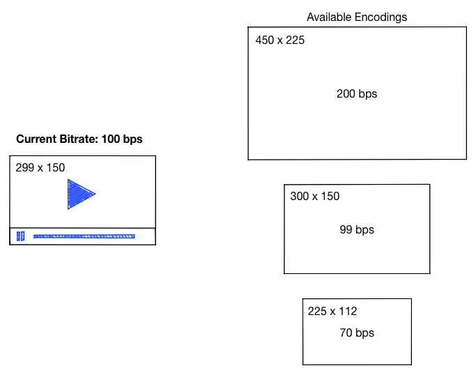
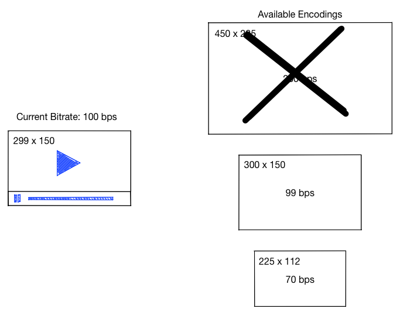
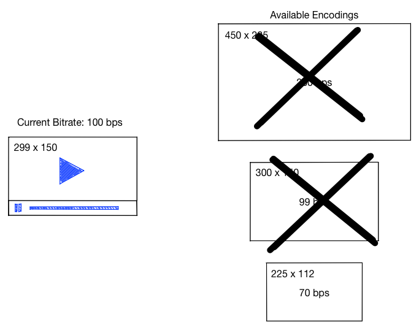
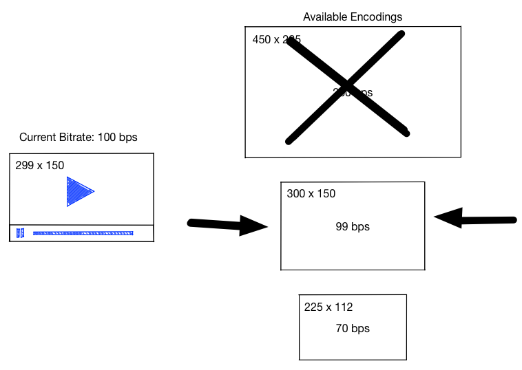

# Adaptive Switching Behavior
The HLS tech tries to ensure the highest-quality viewing experience 
possible, given the available bandwidth and encodings. This doesn't
always mean using the highest-bitrate rendition available-- if the player
is 300px by 150px, it would be a big waste of bandwidth to download a 4k
stream. By default, the player attempts to load the highest-bitrate 
variant that is less than the most recently detected segment bandwidth,
with one condition: if there are multiple variants with dimensions greater
than the current player size, it will only switch up one size greater 
than the current player size.

If you're the visual type, the whole process is illustrated
below. Whenever a new segment is downloaded, we calculate the download
bitrate based on the size of the segment and the time it took to
download:

First, we filter out all the renditions that have a higher bitrate
than the new measurement:

Then we get rid of any renditions that are bigger than the current
player dimensions:

We don't want to signficant quality drop just because your player is
one pixel too small, so we add back in the next highest
resolution. The highest bitrate rendition that remains is the one that
gets used:

If it turns out no rendition is acceptable based on the filtering
described above, the first encoding listed in the main playlist will
be used.

If you'd like your player to use a different set of priorities, it's 
possible to completely replace the rendition selection logic. For 
instance, you could always choose the most appropriate rendition by 
resolution, even though this might mean more stalls during playback.
See the documentation on `player.vhs.selectPlaylist` for more details.
