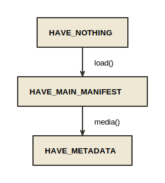
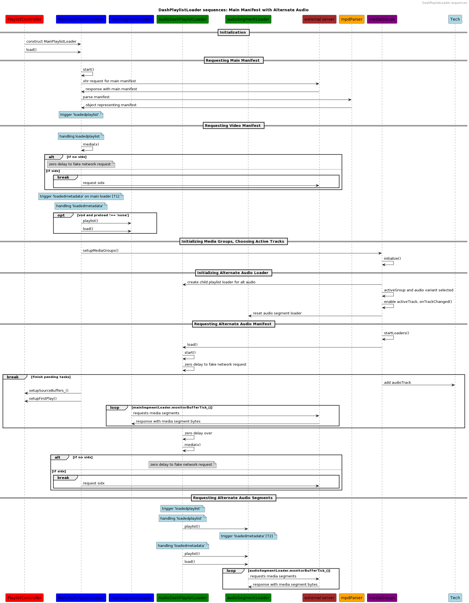

# DASH Playlist Loader

## Purpose

The [DashPlaylistLoader][dpl] (DPL) is responsible for requesting MPDs, parsing them and keeping track of the media "playlists" associated with the MPD. The [DPL] is used with a [SegmentLoader] to load fmp4 fragments from a DASH source.

## Basic Responsibilities

1. To request an MPD.
2. To parse an MPD into a format [videojs-http-streaming][vhs] can understand.
3. To refresh MPDs according to their minimumUpdatePeriod.
4. To allow selection of a specific media stream.
5. To sync the client clock with a server clock according to the UTCTiming node.
6. To refresh a live MPD for changes.

## Design

The [DPL] is written to be as similar as possible to the [PlaylistLoader][pl]. This means that majority of the public API for these two classes are the same, and so are the states they go through and events that they trigger.

### States

- `HAVE_NOTHING` the state before the MPD is received and parsed.
- `HAVE_MAIN_MANIFEST` the state before a media stream is setup but the MPD has been parsed.
- `HAVE_METADATA` the state after a media stream is setup.

### API

- `load()` this will either start or kick the loader during playback.
- `start()` this will start the [DPL] and request the MPD.
- `parseMainXml()` this will parse the MPD manifest and return the result.
- `media()` this will return the currently active media stream or set a new active media stream.

### Events

- `loadedplaylist` signals the setup of a main playlist, representing the DASH source as a whole, from the MPD; or a media playlist, representing a media stream.
- `loadedmetadata` signals initial setup of a media stream.
- `minimumUpdatePeriod` signals that a update period has ended and the MPD must be requested again.
- `playlistunchanged` signals that no changes have been made to a MPD.
- `mediaupdatetimeout` signals that a live MPD and media stream must be refreshed.
- `mediachanging` signals that the currently active media stream is going to be changed.
- `mediachange` signals that the new media stream has been updated.

### Interaction with Other Modules

### Special Features

There are a few features of [DPL] that are different from [PL] due to fundamental differences between HLS and DASH standards.

#### MinimumUpdatePeriod

This is a time period specified in the MPD after which the MPD should be re-requested and parsed. There could be any number of changes to the MPD between these update periods.

#### SyncClientServerClock

There is a UTCTiming node in the MPD that allows the client clock to be synced with a clock on the server. This may affect the results of parsing the MPD.

#### Requesting `sidx` Boxes

To be filled out.

### Previous Behavior

Until version 1.9.0 of [VHS], we thought that [DPL] could skip the `HAVE_NOTHING` and `HAVE_MAIN_MANIFEST` states, as no other XHR requests are needed once the MPD has been downloaded and parsed. However, this is incorrect as there are some Presentations that signal the use of a "Segment Index box" or `sidx`. This `sidx` references specific byte ranges in a file that could contain media or potentially other `sidx` boxes.

A DASH MPD that describes a `sidx` is therefore similar to an HLS main manifest, in that the MPD contains references to something that must be requested and parsed first before references to media segments can be obtained. With this in mind, it was necessary to update the initialization and state transitions of [DPL] to allow further XHR requests to be made after the initial request for the MPD.

### Current Behavior

In [this PR](https://github.com/videojs/http-streaming/pull/386), the [DPL] was updated to go through the `HAVE_NOTHING` and `HAVE_MAIN_MANIFEST` states before arriving at `HAVE_METADATA`. If the MPD does not contain `sidx` boxes, then this transition happens quickly after `load()` is called, spending little time in the `HAVE_MAIN_MANIFEST` state.

The initial media selection for `mainPlaylistLoader` is made in the `loadedplaylist` handler located in [PlaylistController][pc]. We now use `hasPendingRequest` to determine whether to automatically select a media playlist for the `mainPlaylistLoader` as a fallback in case one is not selected by [PC]. The child [DPL]s are created with a media playlist passed in as an argument, so this fallback is not necessary for them. Instead, that media playlist is saved and auto-selected once we enter the `HAVE_MAIN_MANIFEST` state.

The `updateMain` method will return `null` if no updates are found.

The `selectinitialmedia` event is not triggered until an audioPlaylistLoader (which for DASH is always a child [DPL]) has a media playlist. This is signaled by triggering `loadedmetadata` on the respective [DPL]. This event is used to initialize the [Representations API][representations] and setup EME (see [contrib-eme]).

[dpl]: ../src/dash-playlist-loader.js
[sl]: ../src/segment-loader.js
[vhs]: intro.md
[pl]: ../src/playlist-loader.js
[pc]: ../src/playlist-controller.js
[representations]: ../README.md#hlsrepresentations
[contrib-eme]: https://github.com/videojs/videojs-contrib-eme
